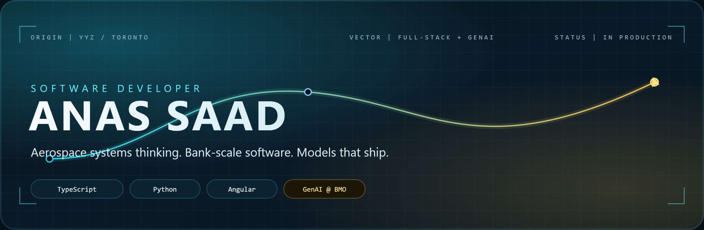

<div align="center">
  
</div>

<br />

<div align="center">
  
</div>

<div align="center">

[](https://github.com/AnasjSaad)
[](https://www.linkedin.com/in/saadanas)
[](https://github.com/AnasjSaad)

</div>

---

## `>_ whoami`

I am **Anas Saad** — a software developer in Toronto who still thinks like an aerospace engineer.

I learned to ship under constraints: one camera, one chance, a flight path that had to close. That same systems instinct now lives in **full-stack software and GenAI at BMO** — models, interfaces, and bank-scale systems that have to work in production, not just in a notebook.

```text
 ORIGIN     Toronto, Canada
 VECTOR     Full-stack · GenAI · Computer Vision
 STACK      TypeScript · Python · Angular
 STATUS     In production
 LANGUAGE   English · Arabic
```

- 🛰️ Started in **avionics, control systems, and computer vision**
- 🏦 Building **software and GenAI** inside a major Canadian bank
- 🧠 Obsessed with anything that learns — models, agents, and the glue around them
- 🏆 First-place autonomous drone mission (takeoff → path → task → land)

---

## `>_ flight_path`

The route was never a straight line. That is the point.

```text
  [ RYERSON / TMU ] -----> [ VISION + CONTROL ] -----> [ BMO / GENAI ]
   aerospace roots           robots that see              software that ships
         *                         *                            *
       YYZ                      93% depth                   IN PRODUCTION
```

| Waypoint | Mission | Notes |
| :--- | :--- | :--- |
| **Aerospace** | Avionics capstone + published computer-vision thesis | Controllers in Simulink. Depth from a single camera. |
| **Machine learning** | Style transfer, churn models, weather, NBA stats | Python, SQL, TensorFlow — curiosity with receipts. |
| **Production software** | Full-stack + GenAI at BMO | TypeScript, Angular, models that leave the lab. |

---

## `>_ payload`

<div align="center">
  
</div>

<br />

| Bay | Loaded |
| :--- | :--- |
| **Languages** | TypeScript · Python · JavaScript · SQL · MATLAB |
| **Frontend** | Angular · React · React95 (yes, really) |
| **AI / ML** | GenAI · Computer vision · TensorFlow · Classical ML |
| **Systems** | Control design · Image processing · QA automation |
| **Currently** | Shipping full-stack + GenAI at bank scale |

---

## `>_ hangar`

Work I am proud to put on the flight line.

<div align="center">
  <a href="https://github.com/AnasjSaad/Robot-Navigation-Computer-Vision">
    
  </a>
  <a href="https://github.com/AnasjSaad/Capstone-Project">
    
  </a>
</div>
<div align="center">
  <a href="https://github.com/AnasjSaad/ImageStyleTransfer">
    
  </a>
  <a href="https://github.com/AnasjSaad/portfolio">
    
  </a>
</div>

| Callsign | What it is | Why it matters |
| :--- | :--- | :--- |
| [**Robot Navigation**](https://github.com/AnasjSaad/Robot-Navigation-Computer-Vision) | Underwater pipeline vision on **one camera** | Object detection ~78%. Single-image depth ~**93%**. [Published thesis](https://docdro.id/XtHB9rr). |
| [**Capstone Drone**](https://github.com/AnasjSaad/Capstone-Project) | Autonomous mission: takeoff, path, drill, land | Simulink controllers + Arduino + vision. **1st place.** [Flight film](https://youtu.be/uv47V7Bhrp4). |
| [**Style Transfer**](https://github.com/AnasjSaad/ImageStyleTransfer) | Neural style transfer in TensorFlow | Generative ML, explained in-notebook — art with gradients. |
| [**React95 Portfolio**](https://github.com/AnasjSaad/portfolio) | Personal site in a Windows 95 shell | Because serious engineers can still have fun. |
| [**NBA Analysis**](https://github.com/AnasjSaad/NBADataAnalysis) | SQL + Python basketball deep-dive | Clean, query, plot. A fan with a `GROUP BY`. |
| [**Churn Prediction**](https://github.com/AnasjSaad/Telecom-Churn-Prediction) | Telecom churn models | Classification with business teeth. |
| [**YYZ Weather**](https://github.com/AnasjSaad/TorontoWeatherForcasting) | Toronto weather forecasting | Predicting the only thing Torontonians trust less than a forecast. |
| [**Spotify Generator**](https://github.com/AnasjSaad/Spotify_Playlist_Generator) | Playlist generator notebook | Data in, vibes out. |

---

## `>_ telemetry`

<div align="center">
  
  
</div>

<div align="center">
  
</div>

---

## `>_ hail`

If you are hiring, collaborating, or just want to talk models, flight, or basketball — ping me.

<div align="center">

[](https://github.com/AnasjSaad)
[](https://www.linkedin.com/in/saadanas)
[](https://docdro.id/XtHB9rr)

</div>

<p align="center">
  <sub><code>CLEARANCE  ·  PUBLIC  ·  CLEARED FOR APPROACH</code></sub>
</p>
